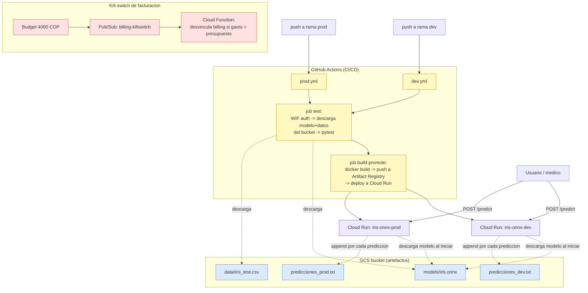

test

# MLOps — Sistema de Despliegue Automático (Proyecto Final)

Sistema de **despliegue continuo de modelos de Machine Learning** sobre la nube.
Cada vez que se publica una nueva versión del código o del modelo, un pipeline de
CI/CD ejecuta pruebas y, si pasan, **despliega automáticamente** un contenedor a un
endpoint vivo en Google Cloud Run — con entornos separados de `dev` y `prod`.

El modelo de ejemplo es un clasificador **Iris** (RandomForest) exportado a
**ONNX**, servido mediante una API **FastAPI** y desplegado en **Cloud Run**.

> **Repo:** https://github.com/Aguado4/aguado-ramirez-mlops-proyecto-final

---

## Tabla de contenidos

1. [Arquitectura](#arquitectura)
2. [Stack tecnológico](#stack-tecnológico)
3. [Cumplimiento de la consigna](#cumplimiento-de-la-consigna)
4. [Estructura del repositorio](#estructura-del-repositorio)
5. [Infraestructura GCP](#infraestructura-gcp)
6. [Cómo funciona el CI/CD](#cómo-funciona-el-cicd)
7. [Protección de costos — kill-switch](#protección-de-costos--kill-switch)
8. [Desarrollo local](#desarrollo-local)
9. [🎤 Guion de la live demo (paso a paso)](#-guion-de-la-live-demo-paso-a-paso)
10. [Reaprovisionar desde cero](#reaprovisionar-desde-cero)
11. [Apagar / limpiar (teardown)](#apagar--limpiar-teardown)

---

## Arquitectura



**Flujo resumido:**
1. Un `push` a `dev` o `prod` dispara el workflow correspondiente.
2. El job **test** se autentica en GCP (sin llaves, vía WIF), descarga el modelo
   ONNX y los datos de prueba del bucket, y corre `pytest`.
3. Si los tests pasan, el job **build-promote** construye la imagen Docker, la sube
   a Artifact Registry y la despliega en el servicio Cloud Run del entorno.
4. El contenedor descarga el modelo del bucket al arrancar y expone `/predict`.
5. Cada predicción se registra (append) en `predicciones_<env>.txt` dentro del bucket.

---

## Stack tecnológico

| Capa | Tecnología | Por qué |
|---|---|---|
| Modelo | **ONNX** + onnxruntime | Formato portable entre frameworks (Unidad 1) |
| API | **FastAPI** + uvicorn | Liviano, async, documentación automática |
| Contenedor | **Docker** | Empaquetado reproducible (Unidad 1) |
| Cómputo | **Google Cloud Run** | Serverless, escala a cero, HTTPS gratis (Unidad 3) |
| Imágenes | **Artifact Registry** | Registro Docker administrado en GCP |
| Almacenamiento | **Google Cloud Storage** | Modelo, datos de prueba y logs de predicciones |
| CI/CD | **GitHub Actions** | Pipelines por rama (Unidad 2) |
| Auth CI/CD | **Workload Identity Federation** | Keyless — la org bloquea SA keys |
| Costos | **Budget + Pub/Sub + Cloud Function** | Kill-switch que apaga el billing |

---

## Cumplimiento de la consigna

| Requisito | Dónde se cumple |
|---|---|
| Repo con CI/CD en GitHub Actions | `.github/workflows/dev.yml`, `prod.yml` |
| Ramas `dev` y `prod`, cada una con su endpoint | servicios `iris-onnx-dev` / `iris-onnx-prod` |
| Pipeline corre en cada push a dev/prod | `on: push: branches: [dev]` / `[prod]` |
| Modelo ONNX, no en el repo, referenciado en bucket | `MODEL_BLOB`, `.gitignore` ignora `*.onnx` |
| Etapa `test`: datos desde bucket + 2 pruebas | `scripts/download_test_data.py`, `tests/test_model.py` |
| Prueba 1: el modelo responde a entrada definida | `test_modelo_responde_con_entrada_definida` |
| Prueba 2: métrica sobre umbral | `test_accuracy_supera_umbral` (accuracy ≥ 0.85) |
| Etapa `build/promote`: Docker + app + deploy | `Dockerfile`, `src/app.py`, workflows |
| App de interacción (FastAPI) | `src/app.py` (`/predict`) |
| Logs de predicciones en bucket (2 archivos txt) | `src/storage.py::append_prediction_log` |

---

## Estructura del repositorio

```
.
├── .github/workflows/
│   ├── dev.yml              # pipeline para la rama dev
│   └── prod.yml             # pipeline para la rama prod
├── src/
│   ├── app.py               # API FastAPI (/predict, /health)
│   ├── model.py             # carga ONNX + inferencia
│   └── storage.py           # descarga de bucket + log de predicciones
├── scripts/
│   ├── train_export_onnx.py # genera iris.onnx + datos de prueba (uso local)
│   └── download_test_data.py# descarga modelo + datos del bucket (CI)
├── tests/
│   └── test_model.py        # 2 pruebas unitarias
├── Dockerfile
├── requirements.txt
└── .env.example
```

---

## Infraestructura GCP

| Recurso | Valor |
|---|---|
| Proyecto | `project-db6add9e-2647-4d19-892` |
| Región | `us-central1` |
| Bucket | `gs://project-db6add9e-2647-4d19-892-mlops-artifacts` |
| Artifact Registry | `us-central1-docker.pkg.dev/project-db6add9e-2647-4d19-892/mlops/iris-onnx` |
| Cloud Run dev | servicio `iris-onnx-dev` |
| Cloud Run prod | servicio `iris-onnx-prod` |
| WIF provider | `projects/735876956273/locations/global/workloadIdentityPools/github-pool/providers/github-provider` |
| Deployer SA | `github-deployer@project-db6add9e-2647-4d19-892.iam.gserviceaccount.com` |

Variables configuradas en GitHub (Settings → Secrets and variables → Actions → Variables):
`GCP_PROJECT`, `GCP_REGION`, `GCS_BUCKET`, `WIF_PROVIDER`, `DEPLOYER_SA`.

---

## Cómo funciona el CI/CD

- **Autenticación keyless (WIF):** GitHub Actions presenta un token OIDC; GCP lo
  valida contra el Workload Identity Pool (restringido a este repo) y permite
  impersonar la `github-deployer` SA. **No hay llaves JSON** — la organización
  personal de la cuenta bloquea su creación por política de seguridad.
- **`dev.yml`** se dispara con push a `dev` → despliega `iris-onnx-dev`.
- **`prod.yml`** se dispara con push a `prod` → despliega `iris-onnx-prod`.
- Ambos tienen los jobs **test** (gate) y **build-promote**.

---

## Protección de costos — kill-switch

Todo el sistema es serverless y **escala a cero** (costo ~$0 en reposo). Como red de
seguridad ante cualquier cargo inesperado se montó un kill-switch:

```
Budget (4000 COP ≈ $1)  ->  Pub/Sub (billing-killswitch)  ->  Cloud Function
                                                               (desvincula el billing
                                                                del proyecto si el gasto
                                                                supera el presupuesto)
```

> ⚠️ Los datos de costo de GCP tienen **rezago de horas**, así que el corte no es
> instantáneo. Si se dispara, el proyecto queda sin billing y hay que **re-vincular
> la cuenta de facturación manualmente** para reactivar los servicios.

---

## Desarrollo local

Todo se puede probar localmente **sin nube** (modo fallback en `src/storage.py`).

```bash
python -m venv .venv && source .venv/bin/activate   # Windows: .venv\Scripts\activate
pip install -r requirements.txt

# 1. generar modelo ONNX + datos de prueba
python scripts/train_export_onnx.py

# 2. correr las pruebas
pytest -v -s tests/

# 3. levantar la API
uvicorn src.app:app --reload --port 8080
curl -X POST localhost:8080/predict -H "Content-Type: application/json" \
     -d '{"features": [5.1, 3.5, 1.4, 0.2]}'
```

---

## 🎤 Guion de la live demo (paso a paso)

> **Duración objetivo:** ~10 min. Todos los comandos `gcloud` asumen que ya
> corriste `gcloud auth login` y `gcloud config set project project-db6add9e-2647-4d19-892`.
> Ten dos pestañas listas: la terminal y la página de **Actions** del repo en GitHub.

### Paso 0 — Pre-demo (haz esto ANTES de presentar)
Los servicios Cloud Run se eliminan para no gastar entre sesiones, así que el primer
push de la demo los recrea. Verifica que el proyecto esté sano:

```bash
# Confirmar billing activo (debe decir True)
gcloud billing projects describe project-db6add9e-2647-4d19-892 \
  --format="value(billingEnabled)"

# Confirmar que el modelo está en el bucket
gcloud storage ls gs://project-db6add9e-2647-4d19-892-mlops-artifacts/models/
```

### Paso 1 — Mostrar el repo y la arquitectura (2 min)
- Abre el repo en GitHub y muestra: ramas `dev`/`prod`, la carpeta `.github/workflows`,
  y este README (diagrama de arquitectura).
- Explica: "el modelo NO está en el repo, vive en un bucket; se descarga en CI y en runtime".

### Paso 2 — Disparar el pipeline con un push a `dev` (3 min)
Haz un cambio mínimo y empújalo para que el público vea el pipeline correr en vivo:

```bash
git checkout dev
git commit --allow-empty -m "demo: disparar pipeline dev"
git push origin dev
```

- Ve a la pestaña **Actions** en GitHub y muestra el run en vivo:
  - job **test**: autentica con WIF, descarga modelo+datos del bucket, corre pytest.
  - job **build-promote**: build Docker → push a Artifact Registry → deploy a Cloud Run.

### Paso 3 — Probar el endpoint dev recién desplegado (2 min)
Cuando el pipeline termine (verde), obtén la URL y haz predicciones:

```bash
DEV_URL=$(gcloud run services describe iris-onnx-dev --region=us-central1 \
  --format="value(status.url)")
echo $DEV_URL

curl -X POST $DEV_URL/predict -H "Content-Type: application/json" \
     -d '{"features":[5.1,3.5,1.4,0.2]}'      # -> setosa
curl -X POST $DEV_URL/predict -H "Content-Type: application/json" \
     -d '{"features":[6.7,3.0,5.2,2.3]}'      # -> virginica
```

### Paso 4 — Mostrar el logging de predicciones en el bucket (1 min)
```bash
gcloud storage cat \
  gs://project-db6add9e-2647-4d19-892-mlops-artifacts/predicciones_dev.txt
```
Cada línea es una predicción con timestamp — base para monitoreo/análisis.

### Paso 5 — Promover a producción (2 min)
```bash
git checkout prod
git merge dev
git push origin prod
```
- Muestra el run de `prod` en Actions.
- Al terminar, prueba el endpoint prod (log separado):
```bash
PROD_URL=$(gcloud run services describe iris-onnx-prod --region=us-central1 \
  --format="value(status.url)")
curl -X POST $PROD_URL/predict -H "Content-Type: application/json" \
     -d '{"features":[4.9,3.0,1.4,0.2]}'
gcloud storage cat \
  gs://project-db6add9e-2647-4d19-892-mlops-artifacts/predicciones_prod.txt
```

### Paso 6 — (opcional) Explicar el kill-switch
Muestra en la consola: **Billing → Budgets** (`killswitch-budget`) y la **Cloud
Function** `billing-killswitch`. Explica el flujo budget → Pub/Sub → desactivar billing.

### Posibles preguntas del profesor — respuestas rápidas
- *¿Por qué ONNX?* Portabilidad entre frameworks; el runtime es liviano para servir.
- *¿Por qué Cloud Run?* Serverless, escala a cero (costo $0 en reposo), HTTPS y deploy simple.
- *¿Cómo se autentica el CI sin llaves?* Workload Identity Federation (OIDC); la org
  bloquea SA keys, así que es la opción segura recomendada.
- *¿Dónde está el modelo?* En GCS; el repo solo guarda una referencia (`MODEL_BLOB`).
- *¿Cómo se separan dev y prod?* Ramas distintas → workflows distintos → servicios
  Cloud Run distintos → archivos de log distintos.

---

## Reaprovisionar desde cero

Si necesitas recrear la infraestructura GCP (o el modelo) desde cero:

```bash
# 1. Generar y subir el modelo + datos
python scripts/train_export_onnx.py
gcloud storage cp iris.onnx \
  gs://project-db6add9e-2647-4d19-892-mlops-artifacts/models/iris.onnx
gcloud storage cp data/iris_test.csv \
  gs://project-db6add9e-2647-4d19-892-mlops-artifacts/data/iris_test.csv

# 2. Recrear los servicios Cloud Run: simplemente hacer push a dev y prod
git push origin dev
git push origin prod
```
El bucket, Artifact Registry, WIF y el kill-switch persisten; lo único que se borra
entre sesiones son los servicios Cloud Run (ver teardown).

---

## Apagar / limpiar (teardown)

Para garantizar **cero gasto** entre sesiones se eliminan los servicios de cómputo.
Lo que se conserva no genera costo apreciable (bucket y AR < free tier) y el
kill-switch escala a cero.

```bash
# Apagar el cómputo (Cloud Run dev y prod)
gcloud run services delete iris-onnx-dev  --region=us-central1 --quiet
gcloud run services delete iris-onnx-prod --region=us-central1 --quiet
```

> Para volver a tener los endpoints vivos antes de la demo, basta con hacer
> `git push origin dev` / `git push origin prod` (el pipeline los recrea).

Si quieres borrar **absolutamente todo** (al cerrar el proyecto):
```bash
gcloud run services delete iris-onnx-dev iris-onnx-prod --region=us-central1 --quiet
gcloud functions delete billing-killswitch --gen2 --region=us-central1 --quiet
gcloud artifacts repositories delete mlops --location=us-central1 --quiet
gcloud storage rm -r gs://project-db6add9e-2647-4d19-892-mlops-artifacts
```
